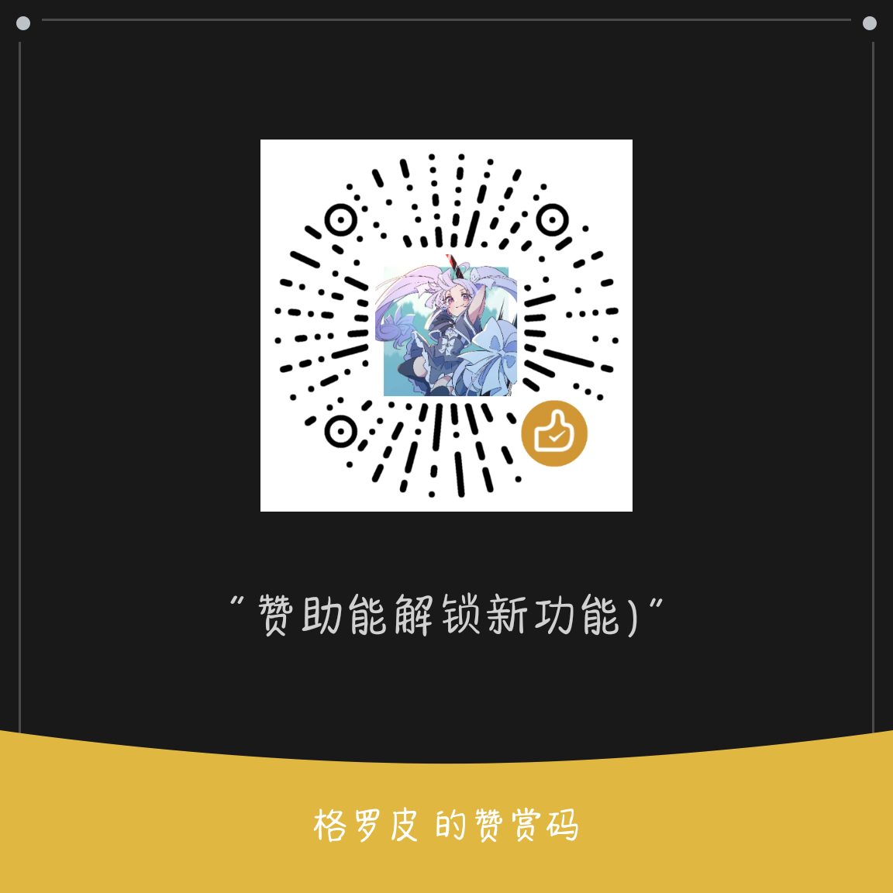

# 中二查歌

一个使用beeware，toga框架写的查歌软件，歌曲数据来源于落雪咖啡屋

# 功能
- [x] 基本查歌
- [x] 分类查歌
- [x] 版本查歌
- [x] 定数筛选
- [x] 歌曲详情
- [x] 曲绘预览
- [ ] 歌曲试听
- [x] 收藏夹
- [ ] 别名查歌

# 运行平台
| 平台 | 状态 | 系统要求|
|---|---|---|
| Windows| | |
| macOS | | |
| Linux | | |
| Android |√| Android 7.0+|

> 有人有其他平台需求我再搞，当然你有能力可以自己弄

# 交流与反馈
欢迎大神入群指导*＜(´・ω・)っ 309546141
差评开发中，如有Bug，请提Issue，我会非常感谢你的

# 其余的话
我并不是专业python的，只是作为一个兴趣，并且还是python萌新，**有答辩代码是非常正常的**，目前是自己敲与AI生成部分代码，如果在某些地方有更好的地方欢迎提交

# 赞助
赏杯奶茶钱呗(

# 更新日志
## 2026-4-17
* 新功能追加:收藏夹
* 更改了搜索界面排版
* 添加了收藏筛选
* 修复了安卓上无法查看图片的bug

## 2026-4-15
* 新功能追加:曲绘预览

## 2026-4-12
* 新功能追加:谱面信息预览
